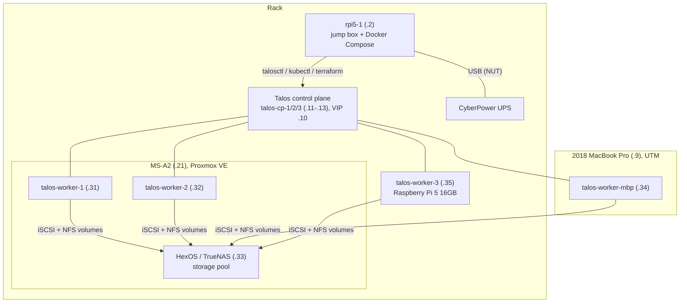
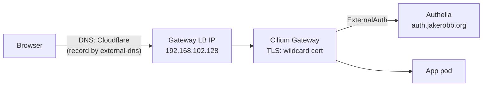

# How it fits together

A map of the homelab: what the main pieces are, how they depend on each other,
and where each one is documented. The [home page](../README.md) has the full
hardware inventory, and each section below links to the details.

## The big picture

- **rpi5-1** is where everything started and still carries the most weight. It
  runs the Docker Compose stack (Home Assistant, Zigbee/Z-Wave, Unbound DNS, the
  UPS monitor and more; see [Docker Compose stack](../docker-compose/README.md)).
  It's also the jump box: the only machine with `talosctl`, the cluster's admin
  credentials and the Terraform runner. It also hosts the cron jobs for backups
  and alert emails.
- **The Kubernetes cluster** runs [Talos Linux](../talos/README.md): three
  Raspberry Pi 5 control-plane nodes and four workers. Two workers are VMs on
  the MS-A2, one is a VM on the MacBook Pro and one is a 16GB Raspberry Pi 5. Workloads are moving off
  rpi5-1's Compose stack into the cluster one at a time
  (see [the plan](../todo/READY.md)).
- **HexOS** (TrueNAS underneath) is a VM on the MS-A2 with the two big NVMe
  drives passed through. It holds the family's shared files and every
  Kubernetes persistent volume, so when HexOS is down, every stateful app in
  the cluster is down too. See [HexOS install](hexos-install.md) and
  [NFS storage](nfs-storage.md).

## How a request reaches an app

Every `*.jakerobb.org` web app in the cluster is reached the same way:

1. **DNS.** [external-dns](../argocd/README.md#dns--tls-decided-2026-09-13)
   creates a Cloudflare record for each app's hostname. The records point at a
   private LAN address (`192.168.102.128`), so the apps only work from inside
   the home network.
2. **Gateway.** Cilium answers ARP for that address (L2 announcements) and
   terminates TLS with a Let's Encrypt wildcard certificate that cert-manager
   renews on its own.
3. **Login.** [Authelia](../argocd/README.md#authelia-sso-decided-2026-09-13)
   gates every app except ntfy, whose clients (phone apps, Alertmanager)
   can't do a browser login. Apps with their own OIDC login (ArgoCD, Headlamp, Radar) talk to
   Authelia directly. Apps without one (Glance, SearXNG, these docs) are
   gated at the Gateway by an `ExternalAuth` filter. Either way, you sign in
   once with a password and a TOTP code.
4. **The app.** The Gateway forwards the request to the app's Service.

The Compose apps on rpi5-1, and LAN devices with their own web UIs, use the
same Gateway. Their routes point at addresses outside the cluster; see
[LAN routes](../argocd/README.md#lan-routes-replacing-caddy-added-2026-09-29).

## How changes get deployed

Almost everything is declared in [this repo](https://github.com/jakerobb/homelab),
and merging to `main` deploys it:

| What | Deployed by | Docs |
| --- | --- | --- |
| Kubernetes apps (`argocd/apps/`, `manifests/`) | ArgoCD, automatically on merge | [ArgoCD and apps](../argocd/README.md) |
| Compose stack (`docker-compose/`) | A cron job on rpi5-1 that pulls `main` | [Compose auto-deploy](compose-deploy.md) |
| PR lint checks (`.github/workflows/lint.yml`) | GitHub Actions on in-cluster ARC runners | [ARC runners](../argocd/README.md#arc-in-cluster-github-actions-runners-added-2026-10-03) |
| Proxmox VMs, Cloudflare, SigNoz dashboards (`terraform/`) | GitHub Actions on the jump box's runner | [Terraform via GitHub Actions](gha-terraform.md) |
| Talos machine config (`talos/patches/`) | By hand with `talosctl` from rpi5-1 | [Talos cluster](../talos/README.md) |
| Secrets | 1Password (`homelab-k8s` vault), synced by External Secrets Operator | [Adding an app](adding-an-app.md#5-secrets-1password--external-secrets-operator) |
| These docs | Rebuilt in-cluster within 5 minutes of a merge | [ArgoCD and apps](../argocd/README.md#docs-site-added-2026-09-28) |

[Renovate](../argocd/README.md#renovate-dependency-updates-decided-and-deployed-2026-09-16)
opens PRs for new versions of charts, images and tools. GitHub Actions checks
every PR: manifests render and validate, secrets are encrypted, and these
docs build without broken links.

## Monitoring and alerts

- **Metrics and logs:** [SigNoz](../argocd/README.md#signoz-decided-and-deployed-2026-09-22)
  (`signoz.jakerobb.org`) collects container logs and metrics from the whole
  cluster. Prometheus (kube-prometheus-stack) scrapes the cluster and the
  hosts, and SigNoz federates from it.
- **Alerts:** Prometheus Alertmanager sends to [ntfy](../argocd/README.md#ntfy-migrated-from-docker-compose-2026-09-20)
  (`ntfy.jakerobb.org`, topic `homelab-alerts`), which pushes to phones.
- **Email:** cron jobs on rpi5-1 (etcd backups, the UniFi GC report) email
  on failure through Brevo. See [Email alerts](email-alerts.md).
- **Dashboards:** [Glance](https://home.jakerobb.org) is the front door,
  with a link to every app. Headlamp (`headlamp.jakerobb.org`) and Radar
  (`radar.jakerobb.org`) are web UIs for the cluster itself.

## Backups

| What | Where | Docs |
| --- | --- | --- |
| etcd (the whole cluster's state) | rpi5-1 daily, synced to Backblaze B2 | [etcd backups](etcd-backup.md) |
| Proxmox host config | rpi5-1 daily | [Proxmox config backup](proxmox-config-backup.md) |
| Terraform state | Backblaze B2 | [Terraform via GitHub Actions](gha-terraform.md) |
| Secrets | 1Password, plus SOPS-encrypted copies in this repo | [Talos cluster](../talos/README.md#secrets-sops--age-decided-2026-09-08) |
